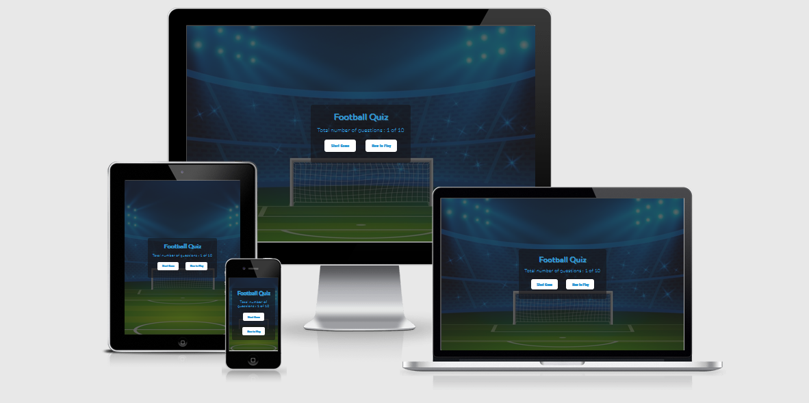

# Football Quiz

[View the live project here](https://preetbhullar90.github.io/html-css-repository/)

## Contents
1. [Introduction](#Introduction)

2. [User Experience](#User-Experience) 
   
3. [Target](#Target)
   
4. [Design](#Design)
  
5. [Features](#Features)

6. [Bugs](#Bugs) 

7. [Other Features](#Other-Features)

8. [Features Left to Implement](#Feature-Left-to-Implement)

9. [Technologies Used](#Technologies-Used)
  
10. [Frameworks Libraries and Programs Used](#Frameworks-Libraries-and-Programs-Used)   

11. [Testing](#Testing)

    - [Testing.md](assets/testing-file/testing.md)

12. [Deployment](#Deployment)

13. [Make a clone](#Make-a-clone)

14. [Credit](#Credit)

15. [Acknowledgements](#Acknowledgements)
***

## Introduction

This game is designed for football lovers.
The focus of this game is to build your knowledge about football and to test the players knowledge about the history of this sport including information about the players, goals and won games.
This game consists of ten multiple choice questions with a choice of four answers. The purpose of the site is to test your knowledge and to learn some new facts about football.
This is my second project out of five milestones projects which students are required to complete in this full stack software development course from Code Institute.
The main programming language I used for this project is HTML, CSS and JAVASCRIPT. It was essential to ensure that this site was responsive on all the devices. 

[Go Top](#Football-Quiz)

## User Experience

### Ideal User Demographic
* New football fans. 
* Current football fans.

### User Stories

#### New football fans :
* As a new player, I want this game to be responsive on all devices.
* As a new player, I want instructions about how to play the game.
* As a new player, I want to see multiple answer choices for each question.
* As a new player, I want to what question I am currently on in the quiz.

#### Current football fans :
* As a Current player, I want to see different questions every time.
* As a Current player, I want to give feedback for the game.

[Go Top](#Football-Quiz)

## Target
* On every game page I added a background of a football pitch with a goal post, I did this so users can easily understand this game is about football players or football history. 
* I added a score tracker for each question. When a player plays this game, he can see the right or wrong answer before the final result.
 This encourages players finish the game to see their final result. 

#### Skeleton
* I used [Figma](https://www.figma.com/file/3CPjEZJrlwFCZhLZUp3eRe/javascript-p2?node-id=0%3A1) Wireframe to attach the following pages:

#### Desktop-Starting-Page
 

#### Tablet-Starting-Page

#### Mobile-Starting-Page

#### Desktop-Questions-Answers-Page

#### Tablet-Questions-Answers-Page

#### Mobile-Questions-Answers-Page

#### Desktop-Username-Page

#### Tablet-Username-Page

#### Mobile-Username-Page

#### Desktop-Result-Page

#### Tablet-Result-Page

#### Mobile-Result-Page

#### Desktop-Feedback-Message-Page

#### Tablet-Feedback-Messages-Page

#### Mobile-Feedback-Message-Page

[Go Top](#Football-Quiz)
## Design

 ### Colour Schema
* I used three colours for this game site. White colour (#fff) used for options background and 
 for all the buttons,Blue colour (#2f99d6) used for all the text and dark Gray colour rgba(21, 20, 24, 0.600); used for game background.
* I chose all the colours I used from w3school website.

#### Typography
* I used a font from the Google font website and linked it with an HTML file.
* I used the font Lato for headings, numbers and for span.
* I used the Oswald font for the questions.
* I used Sans-serif font as a default when the main Lato and Oswald font does not work. By default, this font applied for all the text and numbers. 

#### Imagery
* I used one background image on all the pages. This image is of a football pitch and goal post.
* I used this image to easily inform users that this website is about football. This image does not distract the user in game because I overlayed light colour on it.
* Two more images were used, a green colour image for the right answers and a red colour image for the wrong answers.

[Go Top](#Football-Quiz)

## Features

1.  Starting block.
2.  Questions block.
3.  Result block.
4.  Feedback block.

#### Starting block :
* In the starting block, users will see the starting button and how to play the game.
* On top of the buttons there is a number for the total quiz length in regard to how many questions there are. 
* When the user will click on the how to play button, they will see one instruction block with a closing button.
* Without clicking the closing button, the user won't be able to click the start button or the how to play button.
* Without clicking the start button the user will not be able to enter the quiz.

#### Questions block :
* In the questions block, users will see correct and incorrect answer indicators with green and red colour images.
* Underneath the answer indicators, I have added correct and incorrect answer counters.
 I have also added a progress bar which tracks the user’s progression in the quiz. 
* Under the progress bar the user will see all the length of quiz remaining.
* For every question the user will see four multiple choice options to select from.
* Underneath the choices I have added a home button that takes the user straight to the home page.
* Underneath the choices opposite to the home button the user will be able to see the timer. 
The timer will reset the start of every question, with 20 seconds given for each question. 

#### Result block :
* In the result block. The user is prompted to type their name and click the submit button without typing their name the user cannot get their result as the submit button will disabled.
* After the user has written their name, they will get the result, name and the total correct and incorrect answers displayed on the screen.

#### Feedback block :
* In the feedback block, the user will have the option to select from three emojis according to how happy or unhappy they are with the quiz. 
* After clicking on the review button, the user will get a message thanking them for their feedback

## Bugs
* In the software development field, it is very common to get many bugs in your code.
* A bug that was discovered was that the user was able to answer the same question twice. This was because the answer window appeared on the screen for too long after the user had clicked on an answer.
* I resolved this by reducing the time the game stays on the window after selecting an answer from 300ms to 150ms.

## Issue Left
* There are no issues left.

## Other Features
* When the user selects their answer, they will get a different sound depending on if they choose the correct or incorrect answer.

### Feature Left to Implement
* The user should be able to check their previous scores, regardless of when they completed the quiz.
 The username should be saved in local Storage, hence whenever the user comes back, they will see their previous scores.
* The score history is saved for a month, so when users play again, they can beat their old score.

## Technologies Used

### Languages Used

* [HTML5](https://en.wikipedia.org/wiki/HTML5)
* [CSS3](https://en.wikipedia.org/wiki/CSS)
* [JS](https://en.wikipedia.org/wiki/JavaScript)

